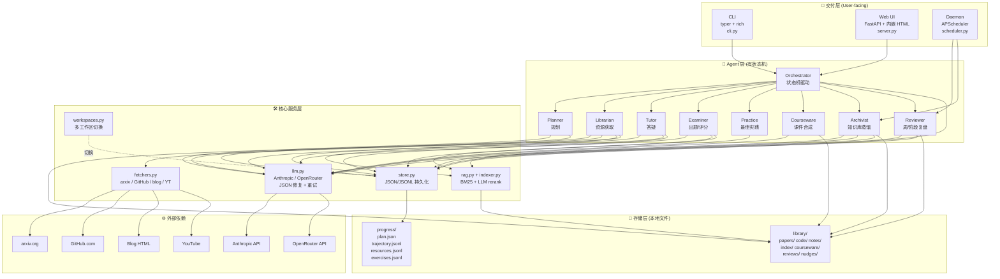
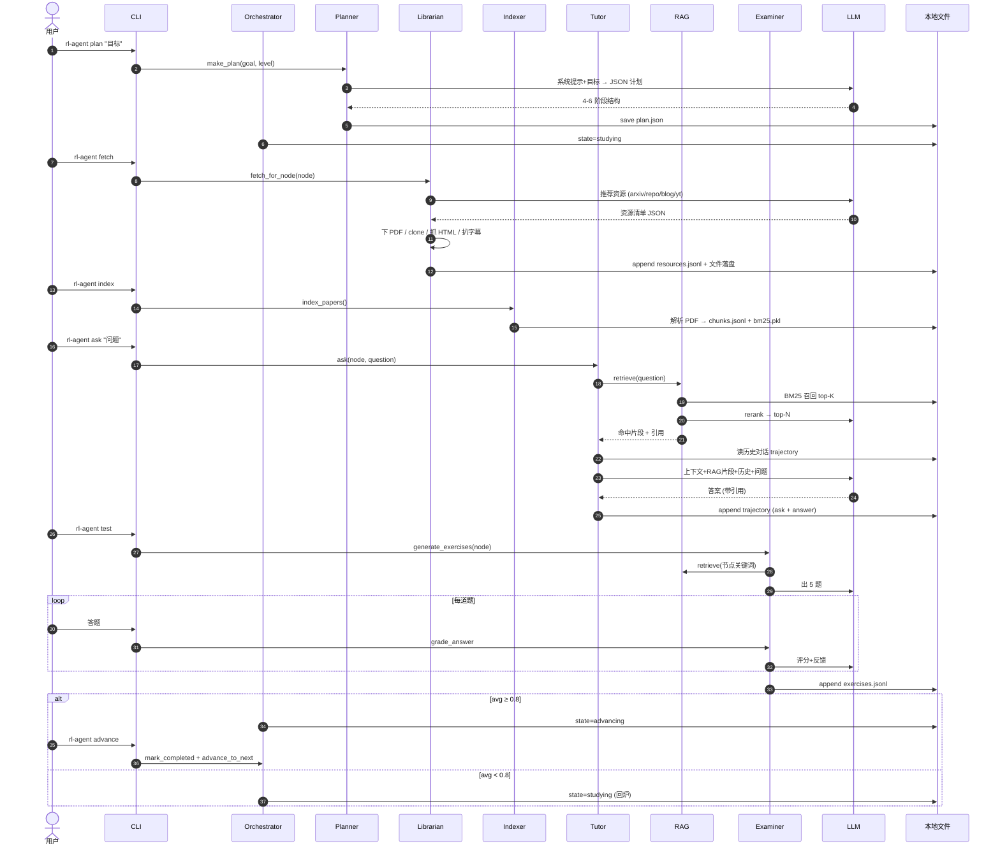
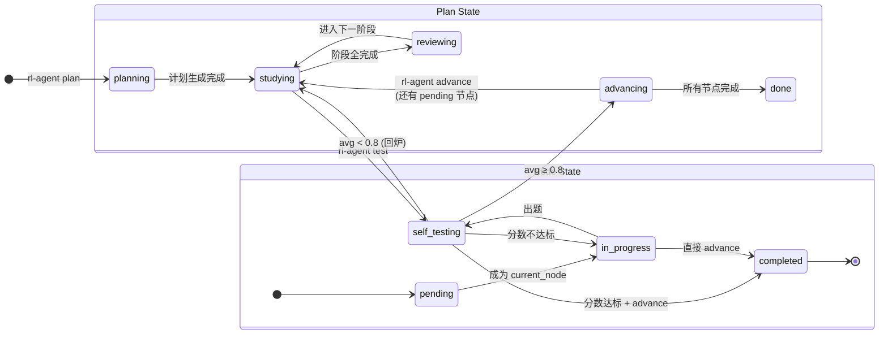
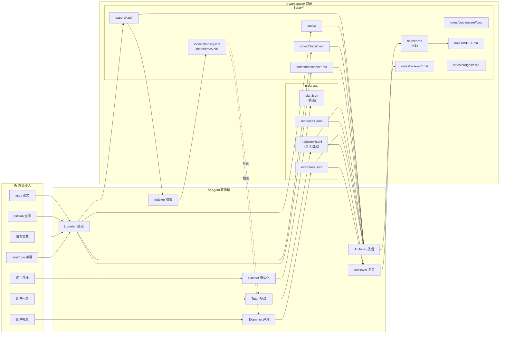
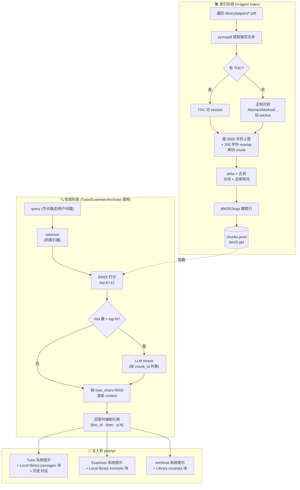

# RL Agent Tutor — 架构文档

> 本文档基于代码本体（v0.3.0）整理。CLI 28 个命令、FastAPI 50+ 路由、9 个 Agent，但底层抽象是清晰的：**状态机 + Agent 工厂 + 本地文件存储 + RAG 横切**。

## 目录

- [图 1：分层架构](#图-1分层架构三层--三种交付形态)
- [图 2：学习闭环 Agent 协作（时序图）](#图-2学习闭环-agent-协作时序图)
- [图 3：状态机（Plan + Node 双层）](#图-3状态机plan--node-双层)
- [图 4：数据流 + 工作区目录结构](#图-4数据流--工作区目录结构)
- [图 5：RAG 管线](#图-5rag-管线最复杂的子系统)
- [架构层面值得注意的设计点](#架构层面值得注意的设计点)

---

## 图 1：分层架构（三层 + 三种交付形态）

---

## 图 2：学习闭环 Agent 协作（时序图）

---

## 图 3：状态机（Plan + Node 双层）

---

## 图 4：数据流 + 工作区目录结构

---

## 图 5：RAG 管线（最复杂的子系统）

---

## 架构层面值得注意的设计点

1. **Orchestrator 实际很轻** —— 只负责状态转换，不调用 Agent；真正的「协作」是用户驱动的（CLI 命令逐个触发各 Agent）。

2. **Daemon 才是真正的"主动 Agent"** —— APScheduler 定时跑 Reviewer 和 Archivist，完成 README 里说的"Agent 主动驱动"承诺。

3. **RAG 是后加的横切关注点** —— Tutor / Examiner / Archivist 三处都注入相同的 `rag.retrieve + render_context` 调用，没抽公共装饰器（可以重构）。

4. **多工作区是运行时切换的** —— `config.WORKSPACE_DIR` 是模块属性，`workspace_path()` 每次调用读最新值，所以 CLI 切换工作区不用重启进程；但 `serve` 进程因为 uvicorn 缓存，切换后必须重启（README 部署文档明确提到了）。

5. **LLM 容错策略分三层** ——
   - 网络层：`_retry` 指数退避 3 次（仅对瞬态错误）
   - JSON 层：`chat_json` 三段救援（去 fence、控制字符转义、最多 3 次重试）
   - 业务层：每个 Agent 接受 LLM 的部分失败（缺资源就跳过、缺字幕就降级）

6. **状态机覆盖不全** —— `reviewing` 状态在代码中只是文档化，没有命令真正把 plan 推进到这个状态；阶段完成事件没有自动触发器，依赖用户手动 `review-stage`。

---

_最后更新：2026-05-25。基于 commit `82e3bf1`。_
